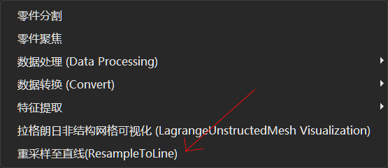
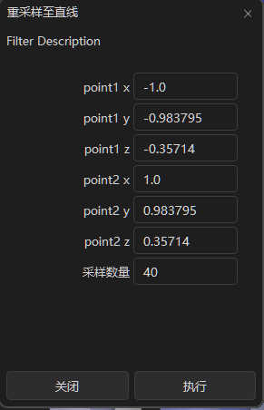

# ResampleToLine 使用说明

## 功能

`iGame::ResampleToLine` 对标 ParaView 的 **Plot Over Line / Resample To Line**（VTK 侧等价于用 `vtkProbeFilter` 沿一条直线探测）：沿给定线段均匀生成采样点，为每个采样点**定位其所在的单元**并插值，输出一条**折线**（点 + 线）以及折线上的属性。

定位与插值语义与 `vtkProbeFilter` / `vtkResampleWithDataSet` 一致：

- 采样点就是线段上的均匀分点（含两个端点）；
- 命中单元的 **Point Data** 按单元形函数插值到采样点；
- 命中单元的 **Cell Data** 按「采样点落在哪个单元」复制到采样点；
- **未命中任何单元（超出容差）的采样点不吸附最近单元**，而是标记为无效：`validpointmask = 0`，其各插值属性**填 0**（与 `vtkProbeFilter` / `vtkResampleWithDataSet` 一致），采样点本身仍保留在输出折线中。





## 输入

单个输入，可以是任意网格；内部统一转换为 `UnstructuredMesh` 后采样（等价 `vtkProbeFilter` 接受任意 `vtkDataSet`）：

1. `UnstructuredMesh`：直接使用；
2. `SurfaceMesh` / `VolumeMesh`：按其面 / 体单元连接关系转换；
3. `StructuredMesh`：按 `(ni, nj, nk)` 尺寸生成 0D 顶点 / 1D 线 / 2D 四边形 / 3D 六面体单元；
4. `LagrangeUnstructuredMesh`：保留 `IG_LAGRANGE_*` 单元类型；
5. `PointSet`（点云）：每个点生成一个 `IG_VERTEX` 单元；
6. **多块输入**：输入对象通过子数据对象组织多个网格块（例如 CGNS 多 zone 的父对象）时逐块转换并合并为一个网格（等价 ParaView 先 Merge Blocks 再 Plot Over Line），采样点命中多个块时取序号靠前的块的数据。

## 输出

- `GetOutput(0)`：`UnstructuredMesh` 折线（`IG_LINE` 单元），与既有流程兼容；
- `GetOutput(1)` / `GetPolyLine()`：`SurfaceMesh` 折线（点 + 边），真正的折线数据，可直接渲染为折线；
- 属性（都挂在采样点上）：
  1. 输入 Point Data 的插值结果（**保留原数组的数据类型与分量数**，整型 / 字符型数组由数组自身截断）；
  2. 输入 Cell Data 按命中单元复制到采样点；
  3. `validpointmask`（`UnsignedCharArray`，`1` = 该采样点插值成功，`0` = 无效）。

## 容差与无效点

- **自动容差**（默认）：被采样网格包围盒对角线 × `1e-6`；`SetTolerance(t)` 手动指定，`t` 是**相对**包围盒对角线的比例，`t <= 0` 恢复自动；`GetEffectiveTolerance()` 返回本次实际使用的绝对容差。
- **单元包含判定的参数域容差与 VTK 一致**：VTK `EvaluatePosition` 判定 `pcoords ∈ [-0.001, 1.001]`（`[0,1]` 参数），即允许 `1e-3` 的越界；`[-1,1]` 参数化的单元（20 / 27 节点六面体、双二次四边形等）等价容差为 `2e-3`。因此**贴单元边界的采样点与 VTK 得到相同的有效 / 无效判定**。
- 超出容差范围 → 该采样点 `validpointmask = 0`、插值属性全 `0`；`GetValidPoints()` 给出有效采样点的 id 列表（等价 `vtkProbeFilter::GetValidPoints()`），`GetSampleCellIds()` 给出每个采样点命中的单元 id（`-1` = 无效）。

## 单元插值内核

1. 0D 顶点单元：采样点落在容差内即取该点数据；
2. 1D 线 / 折线 / 二次边 / Lagrange 曲线：逐段投影取最近的一段做线性插值；
3. 线性面单元（三角形 / 四边形 / 多边形）：重心坐标 / 双线性 / 扇形三角化；
4. 体单元（四面体 / 六面体 / 三棱柱 / 金字塔 / 多面体）：**均值坐标（Mean Value Coordinates）**；四面体的均值坐标即重心坐标，用解析解；
5. 二次 / 高次单元：二次形函数 + 参数坐标 Newton 反解，覆盖 10 类——6 节点三角形、8 节点四边形、10 节点四面体、20 节点六面体、15 节点三棱柱、13 节点金字塔、9 节点双二次四边形、6 节点二次-线性四边形、12 节点二次-线性楔形、27 节点三二次六面体；后四类的节点序与形函数按 VTK 源码硬编码（`vtkBiQuadraticQuad` / `vtkQuadraticLinearQuad` / `vtkQuadraticLinearWedge` / `vtkTriQuadraticHexahedron`）；
6. 未覆盖的高次单元（18 节点双二次-二次楔形、24 节点双二次-二次六面体、19 节点三二次金字塔、含棱中点的 `QuadraticPolygon`、任意阶 `Lagrange*`）：退化为角点线性（面单元）/ 角点线性 + 均值坐标（体单元），数量由 `GetUnsupportedQuadraticCellCount()` 与 `GetMessage()` 提示。

## 主要接口

```cpp
#include <ResampleToLine/iGameResampleToLine.h>
```

| 接口 | 作用 | 默认值 |
| --- | --- | --- |
| `setOrigTarget(Point p0, Point p1, int x)` | 设置起点、终点、采样点数 | `(-1,-0.98,-0.36) → (1,0.98,0.36)`，`x = 40` |
| `SetSampleNumber(int)` / `GetSampleNumber()` | 采样点数（含两端点） | `40` |
| `SetAutoTolerance(bool)` | 是否使用自动容差 | `true` |
| `SetTolerance(double t)` | 手动容差（相对包围盒对角线）；`t <= 0` 恢复自动 | 自动 |
| `GetTolerance()` / `GetEffectiveTolerance()` | 手动值（自动时 `-1`）/ 本次实际绝对容差 | — |
| `Execute()` | 执行采样 | — |
| `GetOutput(0)` / `GetLineMesh()` | 折线（`UnstructuredMesh`，`IG_LINE`） | — |
| `GetOutput(1)` / `GetPolyLine()` | 折线（`SurfaceMesh`，点 + 边） | — |
| `GetSampleValidMask()` | 每个采样点是否有效（与 `validpointmask` 一致） | — |
| `GetValidPoints()` | 有效采样点 id 列表（等价 `vtkProbeFilter::GetValidPoints()`） | — |
| `GetSampleCellIds()` | 每个采样点命中的单元 id，`-1` = 无效 | — |
| `SetValidPointMaskArrayName(name)` | 掩膜数组名；传空串恢复默认；设为 `vtkValidPointMask` 即与 VTK 默认命名一致 | `validpointmask` |
| `GetValidPointMaskArrayName()` | 读取当前掩膜数组名 | `validpointmask` |
| `GetUnsupportedQuadraticCellCount()` | 本次退化为线性角点处理的高次单元数量 | `0` |
| `GetLastInputType()` / `GetLastInputBlockCount()` | 上次输入类型（`IG_*`）/ 参与采样的块数 | — |
| `GetMessage()` | 最近一次执行的消息（采样数、有效数、无效数、容差、退化提示） | `Not Executed !` |

## 调用方式

1. `ResampleToLine::New()` 创建滤波器；
2. `SetInput(data)` 设置输入网格；
3. `setOrigTarget(p0, p1, n)` 指定线段与采样点数（按需 `SetTolerance()`，默认自动即可）；
4. `Execute()`；失败时读 `GetMessage()`；
5. 结果用 `GetPolyLine()`（面折线）或 `GetLineMesh()`（线单元折线）取用；统计时先用 `GetSampleValidMask()` / `GetValidPoints()` 过滤无效点。

## 界面操作

菜单 **滤波器 → 重采样至直线(ResampleToLine)**：打开左侧工具 Tab「重采样至直线」，面板绑定当前模型，可调整起点 / 终点（含轴向快捷按钮）、采样点数与容差（留空 = 自动）；点「执行」后结果作为新节点加入模型树并可直接可视化。

## 使用示例

```cpp
#include <ResampleToLine/iGameResampleToLine.h>
#include <iGameFileIO.h>

#include <iostream>

int main() {
    using namespace iGame;

    auto data = FileIO::ReadFile("Models/RenameResample_test.vtk");
    if (!data) { std::cerr << "读取模型失败\n"; return 1; }

    auto filter = ResampleToLine::New();
    filter->SetInput(data);
    filter->setOrigTarget(Point(-2.0f, -2.0f, -2.0f), Point(2.0f, 2.0f, 2.0f), 41);
    if (!filter->Execute()) { std::cerr << filter->GetMessage() << '\n'; return 1; }

    std::cout << filter->GetMessage() << '\n';               // 采样数 / 有效数 / 实际容差
    const auto& mask = filter->GetSampleValidMask();
    int valid = 0;
    for (unsigned char m : mask) { valid += (m != 0) ? 1 : 0; }
    std::cout << "samples = " << mask.size() << ", valid = " << valid << '\n';

    auto polyLine = filter->GetPolyLine();                    // 可直接渲染的折线
    std::cout << "polyline points = " << polyLine->GetNumberOfPoints() << '\n';
    return 0;
}
```

完整自检示例位于：

```text
Examples/Filter/TestResampleToLine.cpp
```

## 与 ParaView / VTK 的差异

1. 采样点与几何坐标是单精度（框架 `typedef Vector3f Point`），VTK 为双精度；大坐标或高精度场会有末位差异；
2. 体单元使用均值坐标，VTK 使用等参形函数；线性场一致，非线性场在单元内部会有差异；
3. 楔形 / 棱柱的接受域在参数立方体之外**额外要求 `r + s <= 1`**（VTK 只判参数立方体），因此楔形「斜角外」区域的采样点判定可能与 VTK 不同；
4. 未覆盖的高次单元退化为角点线性处理，注意 `GetUnsupportedQuadraticCellCount()` 与消息提示；
5. **不提供吸附半径**：超出容差即判无效（`vtkProbeFilter` 的 `SnappingRadius` 语义在 `ResampleWithDataSet` 中提供）；
6. 多块输入会先合并为一个网格（等价 Merge Blocks），而 VTK 的 executive 会逐块展开并保留块结构；
7. 没有 field 数据（框架 `AttributeSet` 只有 `IG_POINT` / `IG_CELL`），也没有 `vtkOriginalPointIds` / `vtkOriginalCellIds` 这类附加数组。

## 注意事项

1. `validpointmask` 默认名与本工程 `ResampleWithDataSet` 一致；若要与 VTK 输出逐项对比，先 `SetValidPointMaskArrayName("vtkValidPointMask")`；
2. 无效点的插值属性是 `0`，做统计前务必先用 `GetSampleValidMask()` / `GetValidPoints()` 过滤，否则 0 会混进结果；
3. 手动容差是**相对值**（乘包围盒对角线），要绝对长度请用 `GetEffectiveTolerance()`；
4. 输出折线的两个端点一定参与采样（与 VTK 一致），即使端点在模型之外；
5. 「命中单元」走均匀网格加速，一次执行的采样点数 = `GetSampleNumber()`；点数很多时建议先裁剪输入模型；
6. 输出几何是新建对象，不会修改输入模型。